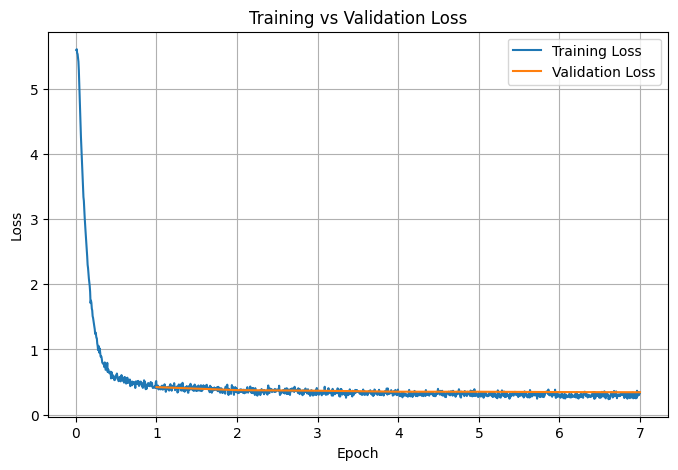
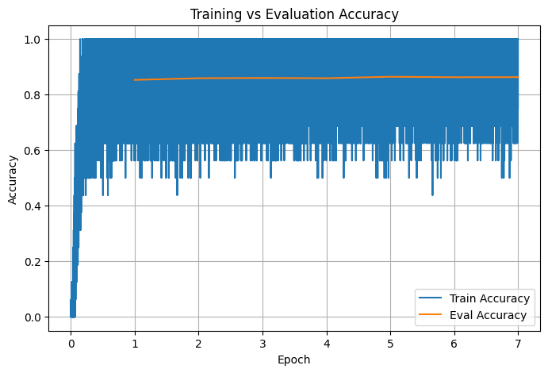
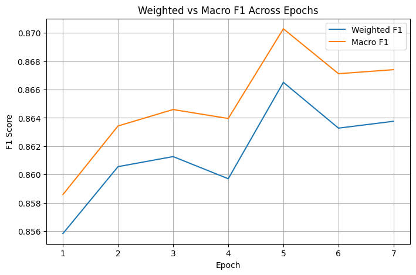
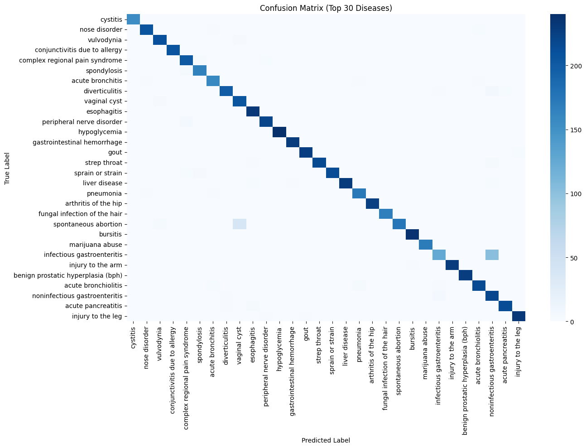

# 🩺 HealthPilot – AI-Driven Symptom Diagnosis Assistant

**HealthPilot** is an AI-powered medical assistant designed to analyze user symptoms and predict the most probable disease using a fine-tuned Transformer model.  
It also provides condition-specific advice through a clean and simple web interface powered by **Flask, HTML, CSS, and JavaScript**.

> ⚠️ HealthPilot is for educational and research purposes only.  
> It should not be considered a medical device or professional diagnostic tool.

---

## 🚀 Features

### 🔹 Intelligent Disease Prediction  
Fine-tuned Transformer (BioBERT/DistilBERT) analyzes user-entered symptoms and predicts the most likely medical condition.

### 🔹 Real-Time Analysis  
Fast inference using PyTorch backend, optimized for CPU execution.

### 🔹 Clean, Minimal UI  
Simple HTML/CSS/JS interface with instant results, no page reload.

### 🔹 Medical Advice Engine  
Maps predictions to curated guidance stored in `advice.json`.

### 🔹 Fully Offline  
HealthPilot works without internet once deployed locally.

---

## 🧠 Tech Stack

**Backend:**  
- Python  
- Flask  
- HuggingFace Transformers  
- PyTorch  
- Pandas / NumPy  

**Frontend:**  
- HTML  
- CSS  
- JavaScript  

---

## 📁 Project Structure
HealthPilot/
│
├── app.py # Flask backend
├── requirements.txt # Python dependencies
├── advice.json # Disease → advice mapping
│
├── index.html
├── style.css
├── script.js
│
├── final-model/ # Final fine-tuned model (config, tokenizer, weights)
│ ├── config.json
│ ├── tokenizer.json
│ ├── special_tokens_map.json
│ ├── tokenizer_config.json
│ ├── vocab.txt
│ └── model.safetensors
│
└── README.md

---

## 📊 Training Curves

### **Loss Curve**

### **Accuracy Curve**

### **F1 Score curve**

### **Heatmp**

---

## 🧬 Model Details

HealthPilot uses a fine-tuned Transformer model based on **BioBERT/DistilBERT**, specifically optimized for symptom-based disease classification.

### ✔ Model Inputs  
- Free-text symptoms (e.g., *"fever, headache, body pain, fatigue"*).

### ✔ Model Outputs  
- Top disease prediction  
- Confidence score (softmax probability)

### ✔ Why Transformers?  
Traditional ML models (SVM, XGBoost) require manual feature engineering.  
Transformers understand natural language directly and capture:

- symptom combinations
- co-occurring patterns  
- contextual phrasing  

## ▶️ How to Run the App Locally

### **1️⃣ Install Dependencies**

### **2️⃣ Run Flask App**

### **3️⃣ Open in Browser**

---

## 📝 License
This project is for educational and experimental use only.  
Predictions generated should NOT be used as a replacement for professional medical diagnosis.

